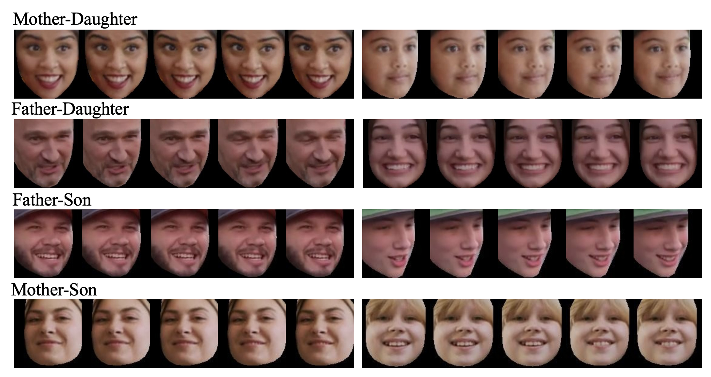
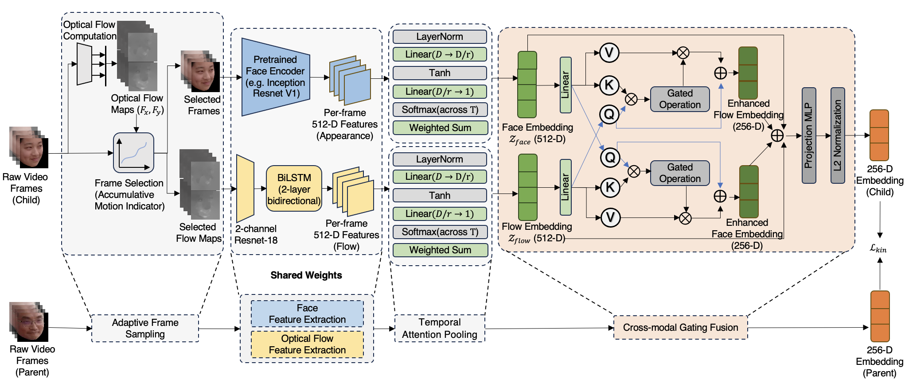
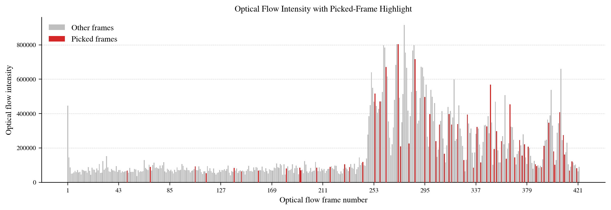
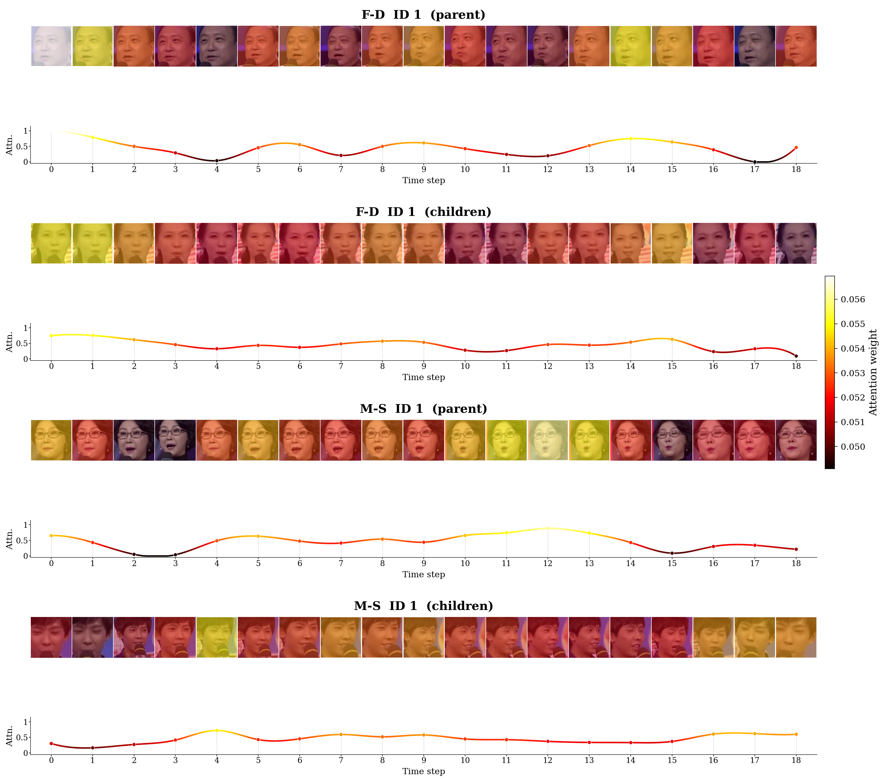
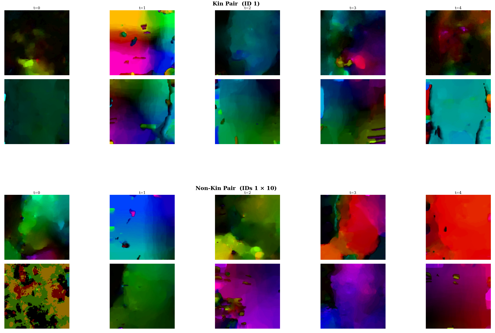
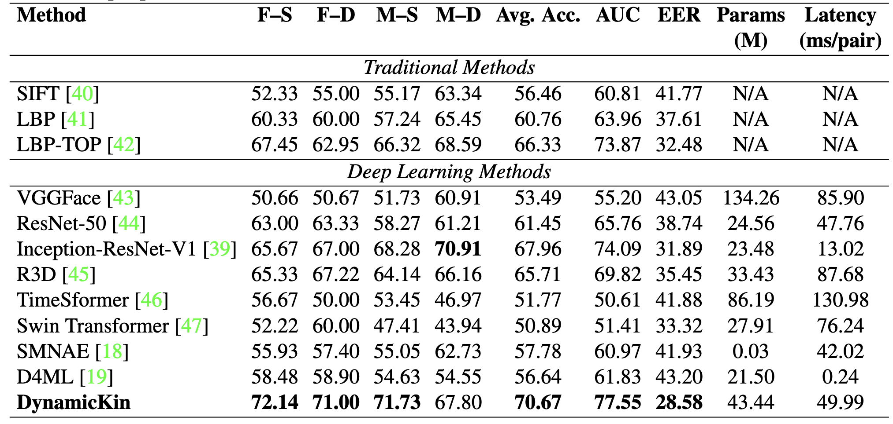

# Smiling Kinship Videos (SKV) Dataset

**SKV** is a video-based benchmark for first-degree kinship verification from facial appearance and facial dynamics. It contains **415 annotated kin pairs from 156 families**, captured in unconstrained real-world videos while subjects are smiling. The consistent expression makes it possible to study whether subtle motion patterns complement the appearance cues used by conventional image-based methods.

<p align="center">
  <a href="https://drive.google.com/file/d/1SCw2lR6ncO760ZGS-SILnQif-4TlF-En/view?usp=sharing"><strong>Download the SKV dataset</strong></a>
  &nbsp;&middot;&nbsp;
  <a href="#the-dynamickin-paper"><strong>Read about DynamicKin</strong></a>
</p>

## Dataset overview

| Statistic | SKV |
|---|---:|
| Families | 156 |
| First-degree kin pairs | 415 |
| Father–Son (F–S) | 103 |
| Father–Daughter (F–D) | 102 |
| Mother–Son (M–S) | 100 |
| Mother–Daughter (M–D) | 110 |
| Minimum source-video resolution | 720p |
| Frames per video | 733 on average; 60 minimum |

The videos were collected from publicly accessible interviews, talk shows, documentaries, and related online footage. SKV controls for smiling expressions but retains natural variation in pose, illumination, occlusion, ethnicity, and recording conditions for generalizability. Faces were detected, tracked, aligned, and cropped with OpenFace to preserve temporal consistency while reducing background bias.



*Representative consecutive frames from Mother–Daughter, Father–Daughter, Father–Son, and Mother–Son pairs (top to bottom).*

## The DynamicKin paper

**DynamicKin: Learning Facial Dynamics via Optical Flow for Video-Based Kinship Verification**<br>
Yifan Lyu and Bob Zhang, University of Macau

DynamicKin is a multimodal Siamese framework designed to use information that a single face image cannot capture. It combines static appearance with optical-flow-based facial dynamics through four stages:

1. **Adaptive frame sampling:** an adapted Motion-Guided Sampler (aMGSampler) uses optical-flow magnitude to retain a compact set of motion-salient frames.
2. **Modality-specific feature extraction:** an Inception-ResNet-V1 encodes facial appearance, while a two-channel ResNet-18 and bidirectional LSTM encode optical flow.
3. **Temporal attention pooling:** the TAP module learns which sampled moments contribute most to the video representation.
4. **Cross-modal gating fusion:** appearance and motion features modulate one another before producing the final kinship embeddings.



*DynamicKin jointly processes the two members of a candidate pair with shared weights, then learns kinship similarity from their fused 256-dimensional embeddings.*

### Motion-guided frame selection

Videos contain many redundant frames. aMGSampler builds a cumulative motion signal from optical-flow magnitude and preferentially selects frames from motion-rich portions of a sequence. This retains expressive changes while keeping the input size fixed and computationally manageable.



*Red bars mark sampled frames; gray bars show the remaining optical-flow frames.*

### Interpreting facial dynamics

The learned temporal attention is not uniform: TAP assigns larger weights to moments that are more informative for the final representation. The visualization below overlays those weights on sampled frames for Father–Daughter and Mother–Son examples.



Optical-flow sequences also reveal how facial motion evolves differently across candidate pairs. The following qualitative comparison shows five time steps for a kin pair and a non-kin pair.



## Results on SKV

Using four-fold, family-disjoint cross-validation with balanced kin and non-kin pairs, DynamicKin achieves:

| Metric | Result |
|---|---:|
| Average accuracy | **70.67%** |
| AUC | **77.55%** |
| EER | **28.58%** |
| Father–Son accuracy | **72.14%** |
| Father–Daughter accuracy | **71.00%** |
| Mother–Son accuracy | **71.73%** |
| Mother–Daughter accuracy | 67.80% |

DynamicKin improves average accuracy by **2.71 percentage points** over the strongest reported appearance-only baseline, Inception-ResNet-V1 (67.96%), supporting the value of combining appearance and motion cues. The full comparison includes traditional descriptors, face encoders, 3D CNNs, video transformers, and video kinship methods.



## Download and intended use

The dataset is available from [Google Drive](https://drive.google.com/file/d/1SCw2lR6ncO760ZGS-SILnQif-4TlF-En/view?usp=sharing). SKV is intended for academic research in kinship verification, facial dynamics, temporal representation learning, and related areas. Users are responsible for following the terms included with the download and for using the data responsibly.


## Citation

If SKV or DynamicKin supports your research, please cite the accompanying paper:

```bibtex
@inproceedings{lyu2026dynamickin,
  title     = {DynamicKin: Learning Facial Dynamics via Optical Flow for Video-Based Kinship Verification},
  author    = {Lyu, Yifan and Zhang, Bob},
  booktitle = {International Joint Conference on Biometrics (IJCB)},
  year      = {2026}
}
```

## Contact

For questions about the dataset or paper, contact the authors at `mc45158@um.edu.mo`.
